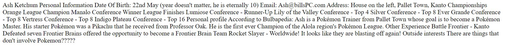
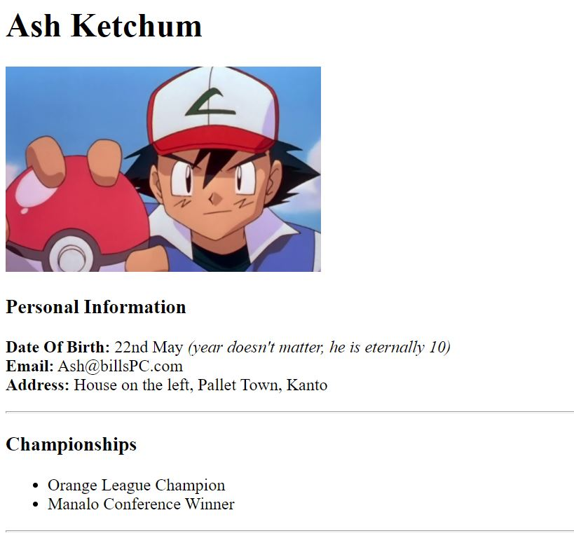
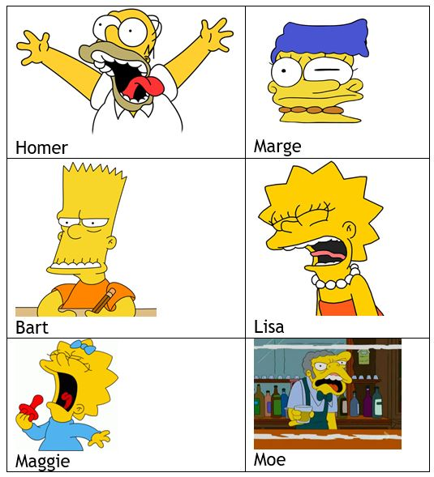
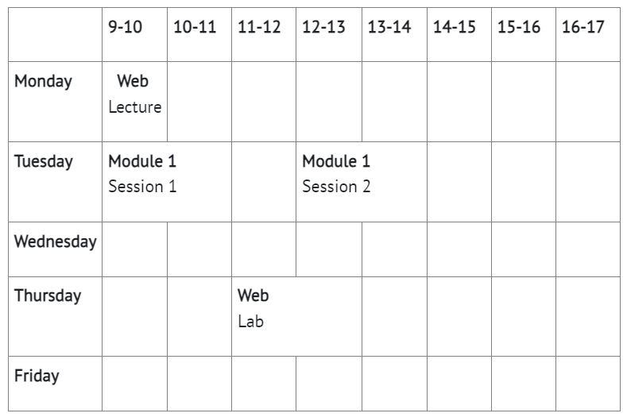

# Week 1 Tasks

Below are the tasks for week 1, you will require many of the tags introduced in the lecture

## Set up
First, I would suggest you install [Visual Studio Code](https://code.visualstudio.com/) if you haven't done so already.  
I'm not set on you using VSCode should you wish to use something else, but all demos for this unit will be done using VSCode and I cannot guarantee the same level of features exist in other environments.

Once you have VScode, you can set up a project folder and open it in VSCode (this is demonstrated in the lecture material)

Next create a new file in VSCode, you can call it what ever you want but one suggestion would be index.html

Good news! I have done some code for you! How nice am I?
All I need you to do is [click here](cv.html)

Now, copy and paste that code in to the file you created in VScode and save

Congrats! The set up is complete! Take a minute to play the final fantasy victory theme in your head (or whatever your go to victory theme is) and then move on to the task below!

## Task 1
Some of you will have read the heading 'set up' above and scrolled straight here.
If you relate to that statement then please spare yourself a few moments of confusion and read it, because that is where you will find the code needed for this task

So hopefully, now you have a html file with the code I provided inside.
The first thing I would like you to do is preview this code in a browser (Chrome, Firefox, Edge - whichever you use)  
You can find a demo for this in the lecture material, video 4 (part 1) - the video timestamp is approximately 2:28.

When you do this, you should see something like this:



Your task is to use the HTML tags demonstrated in the lecture material to get the document to look as follows.

**Hint**: The dividing lines are achieved using the ```<hr>``` tag  
**Hint 2**: The image was sourced from Google  
**Hint 3**: You will see in the images below that the "Personal Profile" section has been cut off in order to fit on this page. There is nothing special about this text so, in your code, just leave it as it is (don't overthink it)

  


## Task 2

Create a new HTML document in VSCode

In web, it is important to be able to find and learn about tags you are not familiar with. Therefore I would like you to research "HTML tables" and then, in your new html page, create a table with 2 columns and 3 rows.

Once you understand tables, you can modify the table created above and place a Simpson’s character inside each cell of the table (if you really object to the Simpsons then feel free to use some other show/game/film).
Find a picture for at least six characters on the Simpsons (or chosen show) and place them in the table.  
Underneath each picture there should be some text telling us who they are.
For example:



## Task 3
Modify task 2 so that when you click the image for each character, you are taken to a Wikipedia page for that character.  
**Note.** I said when the image is clicked, not table cell or text

## Bonus Task
If you are hungry for more then consider attempting this.

Create a new HTML document

Now create a table that represents your university timetable.

This is a bigger task and will require you to look in to how to merge cells

for example:
